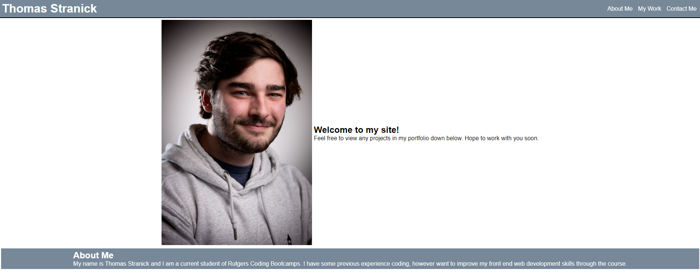
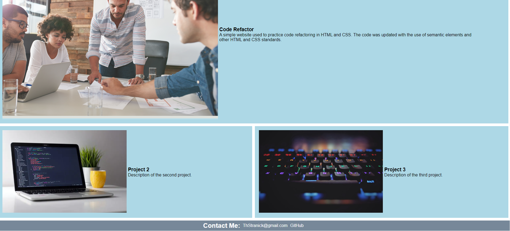

# Professional Portfolio
## Author: Thomas Stranick

## Description

This webpage was created with the intent to use as a professional portfolio. My name and image are displayed along with my projects I have completed to allow anybody viewing the site to know who I am and what I have worked on. I also provide ways to contact me on my email or view my GitHub. The page provides links to sections for easy navigation as well as clickable project images to take the user directly to the project of choice. The page is also responsive, and allows users from many different screen sizes to view the content.

## Visuals

## Deployment

Provided as a link here - [Repo](https://github.com/ThStranick15/professional_portfolio)
-  [Site](https://thstranick15.github.io/professional_portfolio/)

## Usage

To use the webpage, the user can scroll down to view each section, or select the navigation links at the top to go to a specific section. The user can click on the images of the projects to be redirected to the deployed project on GitHub. The webpage can also be resized to 1000px or 700px to view the responsiveness of the webpage. At the bottom there is a link to my GitHub profile.

## Credits

- Unsplash - Placeholder project images
- JD (Bootcamp Instructor) - troubleshooting on grid layout overflowing page

## License

Please refer to the LICENSE in the repo.
